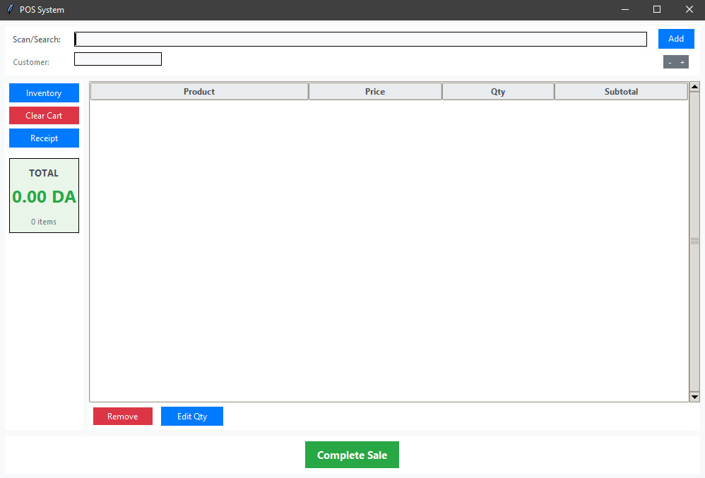
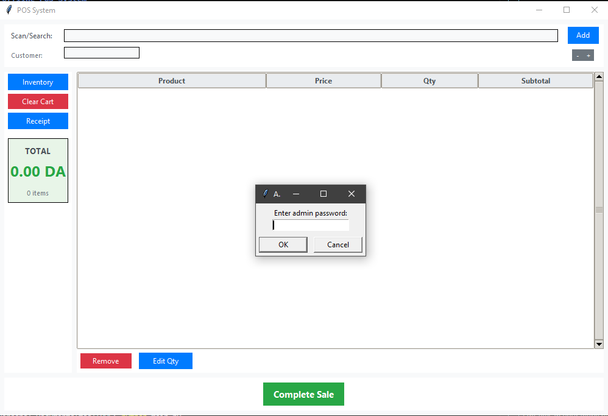
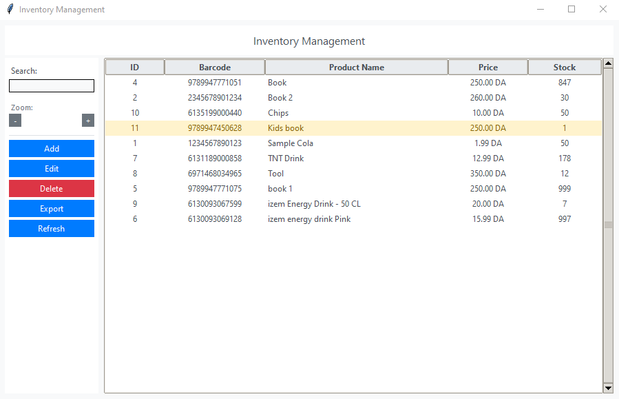

# Hegxib POS – Open Source Point of Sale (POS) System

**Hegxib POS** is a lightweight, offline Point of Sale system for PC. Perfect for small shops, supermarkets, or personal projects.  
---

    
   
---

## Screenshots and Previews

1.   
2.   
3.   


---

## Features

- **Barcode Scanning**: Use your phone as a barcode scanner (HID input)
- **Offline Database**: SQLite-based storage, no internet required
- **Inventory Management**: Add, edit, delete products and manage stock
- **Sales Recording**: Complete transaction logging with timestamps
- **Real-time Cart**: Live cart updates with quantity management
- **Stock Warnings**: Low stock alerts (below 5 units)
- **Export Functionality**: Export inventory to CSV

---

## Setup Instructions

1. **Install Python 3.7+** (tkinter included)

2. **Run the application**:
   ```bash
   python main.py
   ```

3. **Phone Setup**:
   - Install a barcode scanner app that outputs as keyboard input, We Recommend Using https://barcodetopc.com/download/ **(Not Promoting)**
   - Connect phone via USB/WiFi to computer
   - Configure as HID device (_if using other HID compatible Bar code Scanner_)
   - Scanned barcodes will appear in the barcode input field

---

## Usage

1. Add products with names, serial numbers, and quantity

2. Scan items using barcode scanner apps

3. Modify, remove, or multiply items in the list

4. Checkout and generate/print receipts

---

### Main POS Interface
- **Barcode Field**: Auto-focused for phone scanner input
- **Add Product**: Manual barcode entry or scan
- **Shopping Cart**: Real-time display of scanned items
- **Checkout**: Process sale and update inventory

---

### Inventory Management
- Access via "Inventory Management" button
- Add new products with barcode, name, price, stock
- Edit existing products
- Delete products
- Export inventory to CSV
- Stock level monitoring

---

### Checkout Process
1. Scan products (adds to cart automatically)
2. Adjust quantities if needed
3. Click "Checkout" to finalize sale
4. Inventory automatically updated

---

## Database Structure

- **products**: barcode, name, price, stock
- **sales**: timestamp, total_amount
- **sale_items**: sale_id, product_id, quantity, subtotal

---

## Files

- `main.py`: Main POS interface
- `database.py`: SQLite database operations
- `inventory_manager.py`: Inventory management interface
- `pos_system.db`: SQLite database (created automatically)

---

## Phone Scanner Setup

1. **Android**: Use "Barcode Scanner +" or similar apps with **HID keyboard mode** (_**the Toolused for Testing**_ https://barcodetopc.com/download/)
2. **iPhone**: Use "Scan" app or similar with keyboard output 
3. **Connection**: USB preferred for reliability, WiFi as alternative (Dev used only **WI-FI** During Testing)
4. **Configuration**: Set scanner to send data as keyboard input with Enter/Return after each scan

**_if you have professional Scanning Tools like Bar Code Scanner (MP7000 Scanner Scale by Zebra) it will be Perfect for Offline Work, The App i mentioned Earlier Worked just great but it was kind of annoying when it comes to scanning the Same item Twice (Notice and errors)_**

---

## Security Features

- Admin access to inventory management (**_Default Admin Password is : admin123_**)
- Local database backup capability
- No network dependencies to Prevent Hacking or Similar
  
---

## Deployment

To create standalone executable:
```bash
pip install pyinstaller
pyinstaller --onefile --windowed main.py
```

The system will run completely offline once deployed.

# Contributing

**You can contribute by:**

- Submitting pull requests

- Forking the repository

- Contacting me on Discord, Telegram, or Email

- Even beginners can fork the repo and make changes easily.

---

# SUPPORT

_**Support me to keep this Repo Up-to-Date by Donating at :**_

1. **KO-FI.COM :** https://ko-fi.com/hegxib 
2. **CRYPTO ETH MetaMask: 0x83Cc0fe051bEf3c8D7633665F165fd9E1AFb10fC**

